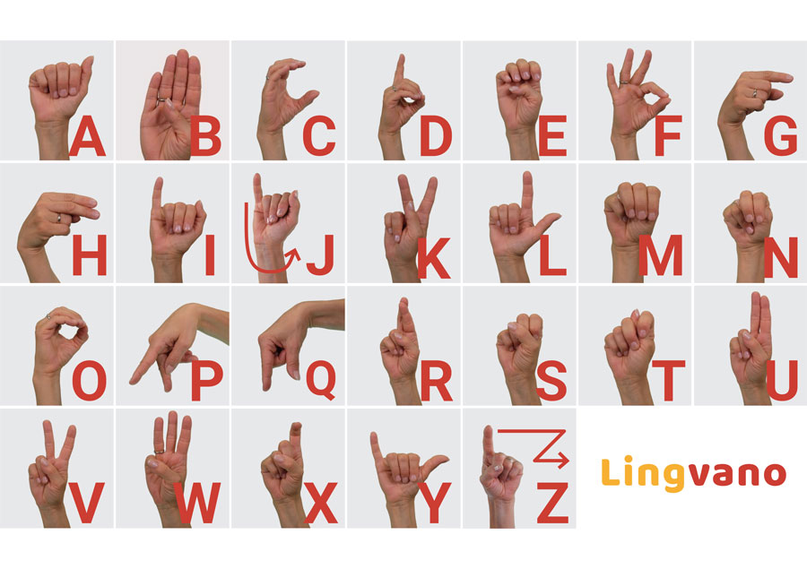
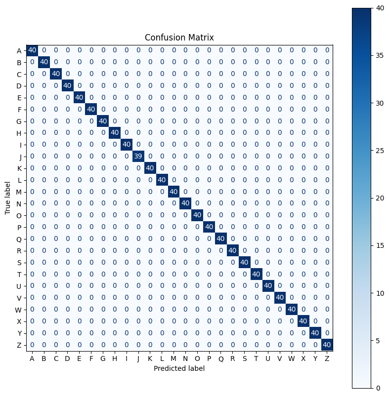

# ASL fingerspelling keyboard

American Sign Language Fingerspelling Recognition: [Google I/O 2023](https://blog.tensorflow.org/2023/05/american-sign-language-fingerspelling-recognition.html)

Fingerspelling Detector with Python, OpenCV and Mediapipe  

- Handle space by putting your **hand down**
- Handle changing gesture by adding **Timing Threshold**
- Handle duplicate characters with **Unknown** hand gesture

> __Note:__ Currently using ASL <kbd>"Number 5"</kbd> for <kbd>"Unknown Letter"</kbd> and <kbd>"A"</kbd> for <kbd>"Unknown Number"</kbd>  

<!--  -->
<p align="left">
  
</p>

```bash
# Create & Activate environment
$ conda create -n mediapipe python=3.10
$ conda activate mediapipe

# Install dependacies
$ pip install -r requirements.txt
```

## Training Pipeline

You can download dataset from [Google - American Sign Language Fingerspelling Recognition](https://www.kaggle.com/competitions/asl-fingerspelling/data)  

You can also create your own dataset by running **pipeline** in <kbd>train.ipynb</kbd>:

1. Collect images dataset from **Webcam**
2. Create dataset from collected images
3. Train classifier model using **Random Forest**

<!--  -->


## Models

To support the full functionality of our demo. You need the following models located in these paths:

```bash
ASL-Finger-Spelling-To-Text
└── classifier
    ├── classify_letter_model.p
    └── classify_number_model.p
```


## Inference

You can recognize __Thai Number__ in <kbd>Thai_Number.ipynb</kbd>

**Instruction:**  

1. <kbd>Esc</kbd> to quit the application
2. <kbd>R</kbd> to start detecting hand gesture
2. <kbd>S</kbd> to quit and save recognition result
3. <kbd>C</kbd> to clear all output words
3. <kbd>M</kbd> to change mode between number and letter
4. <kbd>Backspace</kbd> to delete last word


```bash
$ python main.py --help
usage: main.py [-h] [-s SOURCE] [-a] [-g] [-v] [-t TIMING] [-wi WIDTH] [-he HEIGHT] [-f FPS]

options:
  -h, --help                      show this help message and exit
  -s SOURCE,  --source SOURCE     Video Path/0 for Webcam
  -a,         --autocorrect       Autocorrect Misspelled Word
  -g,         --gif               Save GIF Result
  -v,         --video             Save Video Result
  -t TIMING,  --timing TIMING     Timing Threshold
  -wi WIDTH,  --width WIDTH       Webcam Width
  -he HEIGHT, --height HEIGHT     Webcam Height
  -f FPS,     --fps FPS           Webcam FPS
```


### Example

```bash
# For Webcam Input
$ python main.py
$ python main.py --source 0

# For Video Input
$ python main.py --source "./assets/Learn_ASL.mp4"
$ python main.py --source "./assets/Practice_ASL_1.mp4"
$ python main.py --source "./assets/Practice_ASL_2.mp4"

# To Use Autocorrect
$ python main.py --source "/Path/to/Video" --autocorrect

# To Save Result
$ python main.py --source "/Path/to/Video" --gif
$ python main.py --source "/Path/to/Video" --video
```


## Todo

<!-- - [ ] Handle Space by crossing hands? -->
<!-- - [ ] Handle Duplicate by moving left and right? -->
- [x] Classify 26 Alphabets
- [x] Classify USA Numbers
- [ ] Improve Dataset
- [ ] Increase Accuracy
- [x] Handle Space between words
- [x] Handle duplicate character
- [x] Handle both 2 hands
- [x] Switch between alphabet and number
- [ ] Handle !#$%&'()*+,-./:;=?@[_~
- [x] Autocorrect misspelled words
- [x] Parse Arguments to main app


# Resource

- [MediaPipe](https://developers.google.com/mediapipe)
- [Sign Language Detector](https://github.com/computervisioneng/sign-language-detector-python/tree/master)
- [Hand Gesture Recognition](https://github.com/kinivi/hand-gesture-recognition-mediapipe/tree/main)
- [Keypoints Classification](https://github.com/kinivi/hand-gesture-recognition-mediapipe/blob/main/keypoint_classification_EN.ipynb)
- [Number Hand Gesture Recognition](https://github.com/NatthanonNon/HGR-TH/tree/main)
- [Google I/O Kaggle Competition](https://www.kaggle.com/competitions/asl-fingerspelling/overview)
- [ASL Fingerspelling Recognition w/ TensorFlow](https://www.kaggle.com/code/gusthema/asl-fingerspelling-recognition-w-tensorflow)
- [ASL Animated Visualization](https://www.kaggle.com/code/rafiko1/aslfr-animated-visualization)